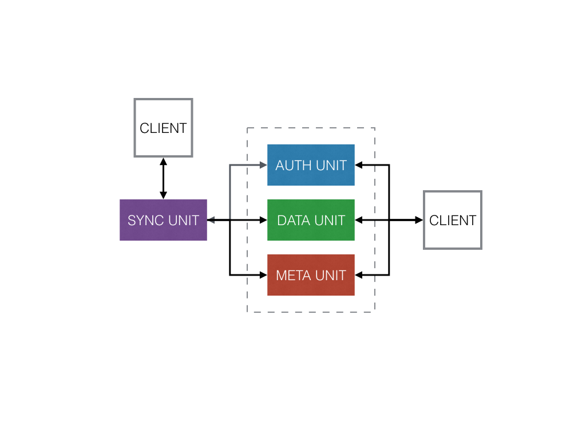
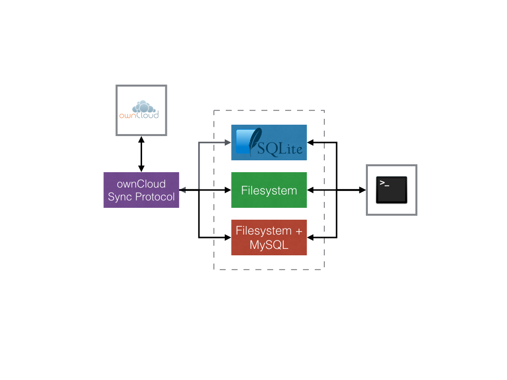

# Design

ClawIO design is highly influenced by the latest developments of file systems and object storages with a focus on high performance data handling, in particular by [CERN EOS project](http://eos.web.cern.ch/content/about-eos).

ClawIO architecture is also influenced by the architecture specification found on the [IETF Internet Sync Storage draft](https://datatracker.ietf.org/doc/draft-cui-iss-problem/?include_text=1).

## Key terms

ClawIO basic data unit is the **Resource**.

A Resource is one of these types:

* A **Container**: a resource that can contains others resources inside.

* An **Object**: a resource that contains binary data.

ClawIO provides an abstraction over local file systems and the terms folder and file are just implementations of such concepts.

Advanced architectures can be created on top of such concepts.

Even, it allow you to create your SpotifyFS, at the end, an album is a container of songs and songs are objects.

## Logical Units

ClawIO is divided into four main logical units.

* Authentication unit
* Data unit
* Metadata unit
* Sync unit

*Further developments will include a Share unit.*

## The Core

The ClawIO Core is composed of just three logical units: authentication, data and metadata unit.

The Authentication Unit is responsible for authenticating users against an Identity Provider.
ClawIO is shipped with a Authentication Unit that authenticates users against a SQLite3 database.

The Data unit is responsible for uploading and download binary data. Nothing else.

The Metadata Unit is responsible for handling a resource hierarchy and operating such hierarchy. Actions that involve the Metadata Unit include listing containers, creating containers, removing, moving and copying resources.

## Default architecture

The default architecture shipped with ClawIO is the following:

The Authentication Unit is implemented with a SQLite3 database. 

*Further developments will include LDAP/AD and Shibboleth Authentication Units.*

The Data Unit is implemented on top of a common filesystem like EXT4, EXT3, extFAT, NTFS and FAT. The object is saved atomically in a file.

* Authentication Unit: implemented using a SQLite3 database.

* Data Unit: implemented using commonn filesystems like EXT4, exFAT, XFS ...
* Meta Unit: implemented using common filesystems plus a MySQL database.
* 