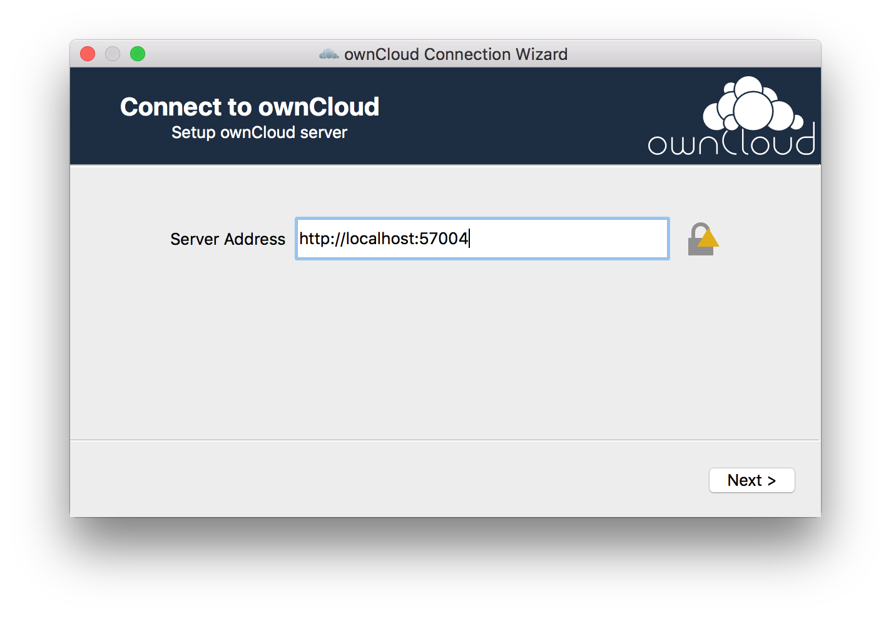
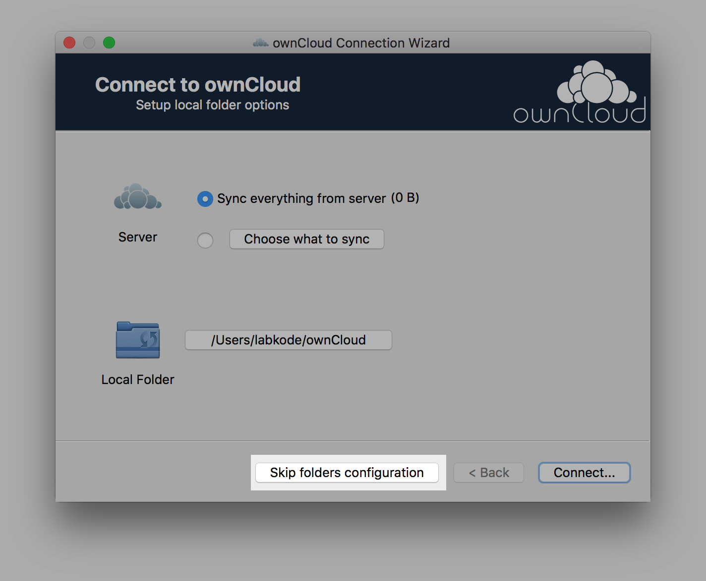
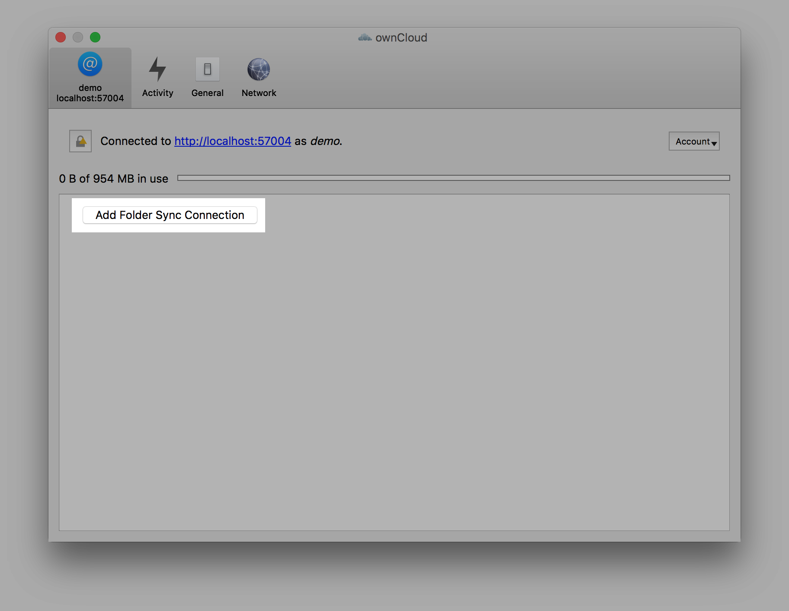
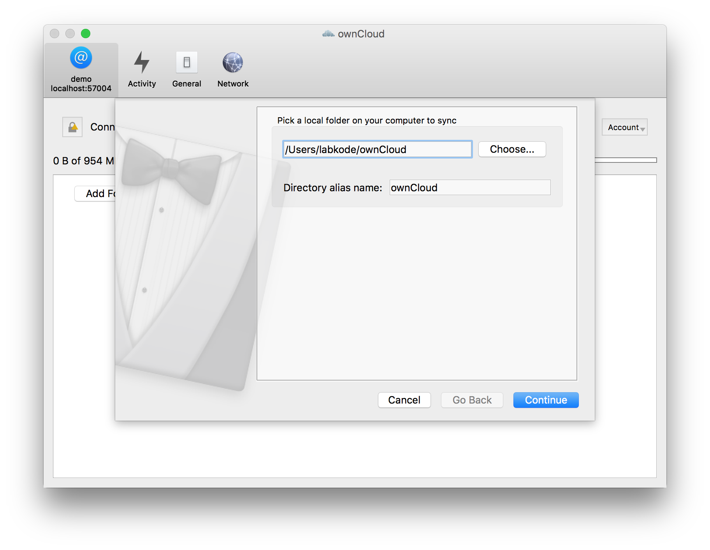
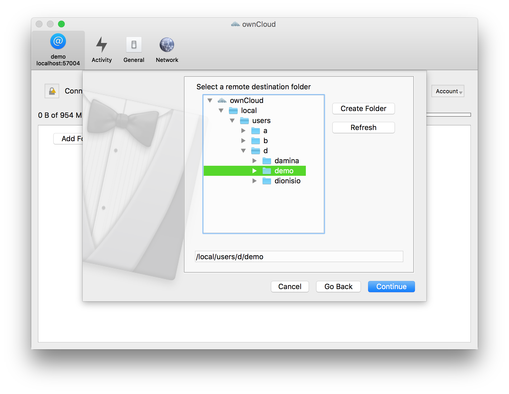
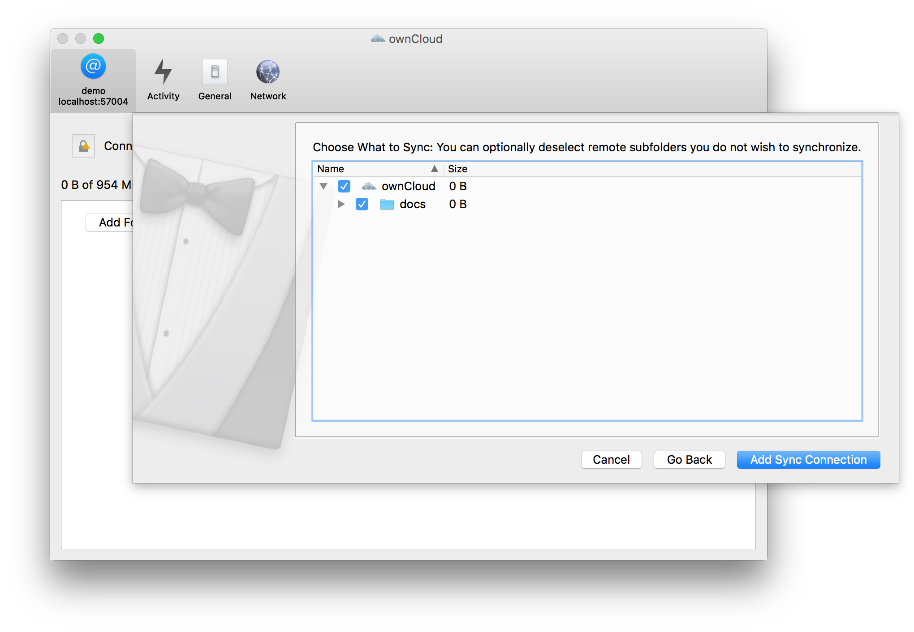

# Getting started

In this tutorial you will install ClawIO and play with it.

## Requirements
You need to have installed:

* [Docker](http://docs.docker.com/)
* [Docker Compose](http://docs.docker.com/compose/install/)

## Installing ClawIO

```
curl --silent --show-error https://raw.githubusercontent.com/clawio/orches/master/install | sh
 ```
 If everything went correct, you should see the services up and running.
 
```

            Name                           Command               State            Ports
-------------------------------------------------------------------------------------------------
service.auth                    /bin/sh -c /go/bin/service ...   Up      0.0.0.0:57000->57000/tcp
service.elk                     /app/bin/start                   Up      0.0.0.0:9200->9200/tcp
service.localstore.data         /bin/sh -c /go/bin/service ...   Up      0.0.0.0:57002->57002/tcp
service.localstore.meta         /bin/sh -c /go/bin/service ...   Up      0.0.0.0:57001->57001/tcp
service.localstore.prop         /bin/sh -c /go/bin/service ...   Up      0.0.0.0:57003->57003/tcp
service.localstore.prop.mysql   /entrypoint.sh mysqld            Up      0.0.0.0:3306->3306/tcp
service.ocwebdav                /bin/sh -c /go/bin/service ...   Up      0.0.0.0:57004->57004/tcp
```

## Using ClawIO CLI
ClawIO CLI is a command line program that lets you interact with the ClawIO server in a very convenient way.

The quickest way to use ClawIO CLI is to run it inside another docker container.

```
 docker run -it --link "service.auth:service-auth" --link "service.localstore.data:service-localstore-data" --link "service.localstore.meta:service-localstore-meta" labkode/clawio bash

```

Once inside the container run
```
clawio help 
```
to get a list of the available commands.

```
ClawIO is a framework to test different tech stacks against sync protocols

Usage:
  clawio [command]

Available Commands:
  env         Print env vars used by the cli
  login       Login into ClawIO
  logout      Logout from ClawIO
  stat        Stat a resource
  rm          Remove a resource
  home        Create user home directory
  mkdir       Creates a container
  upload      Upload an object
  download    Download an object
  mv          Moves a resource
  cp          Copies a resource

Use "clawio [command] --help" for more information about a command.
```

Before interacting with the system we have to log into the server.

```
clawio login demo demo
```


In order to upload objects and create containers, we need to create our home container (~) first.

```
clawio home 
```

Lets list the resources in our home directory.

```
clawio stat /local/users/d/demo --children
```

We have not any resource yet so the list will just contain our home container (*/local/users/d/demo*).
```

ID                                    Path                 Container  Size  Modified    Permissions  ETag                                  Mime             Checksum
7c7dd6c8-d91a-450f-bd86-78f9c840ef55  /local/users/d/demo  true       4096  1448536338  0            f415602a-05df-4399-a53a-da8b4d206737  inode/container
```

Create a new container.

```
clawio mkdir /local/users/d/demo/docs
```

After listing again the new container will appear under our home.

```
ID                                    Path                      Container  Size  Modified    Permissions  ETag                                  Mime             Checksum
7c7dd6c8-d91a-450f-bd86-78f9c840ef55  /local/users/d/demo       true       4096  1448824962  0            ed66ceae-5693-4d7a-9e1a-28add86a2b2b  inode/container
2c168e13-8664-4ba8-955d-ff2f28979a53  /local/users/d/demo/docs  true       4096  1448824962  0            ed66ceae-5693-4d7a-9e1a-28add86a2b2b  inode/container
```

Lets upload a file to the new recently created container.
```
clawio upload /etc/passwd /local/users/d/demo/docs/mypasswd
```

Now the file is saved on the server.

```
clawio stat /local/users/d/demo/docs --children
```

```
ID                                    Path                               Container  Size  Modified    Permissions  ETag                                  Mime                      Checksum
2c168e13-8664-4ba8-955d-ff2f28979a53  /local/users/d/demo/docs           true       4096  1448825092  0            ef7dc98f-1d2f-4ce7-b5d6-30174af714d4  inode/container
c8c9bb0e-e0db-4205-b987-95e4efd3eb0d  /local/users/d/demo/docs/mypasswd  false      5937  1448825082  0            4f96acf7-e782-4333-8d8f-6e7ee510d24c  application/octet-stream
```

We can even provide a checksum when uploading the file to avoid data corruption in the transmission.

```
clawio upload /etc/passwd /local/users/d/demo/mypasswd --checksum="md5:c15ba5ba9f0e0bcee0866b6e8c40d4c7"
```

```
ID                                    Path                               Container  Size  Modified    Permissions  ETag                                  Mime                      Checksum
51df577a-aa1f-463e-ace4-97cd89f52711  /local/users/d/demo/docs           true       4096  1448826356  0            9d5655b3-a5db-49ec-8289-20306e7a7398  inode/container
a8362af2-aa48-4f46-8cb9-55bfb7440597  /local/users/d/demo/docs/mypasswd  false      5937  1448826348  0            85f4eba0-0b17-4043-a9f9-0dceeb69a8e4  application/octet-stream  md5:c15ba5ba9f0e0bcee0866b6e8c40d4c7
```

The ClawIO CLI has more functions to play with, feel free to experiment or check the ClawIO CLI documentation.


## Using ownCloud Desktop Clients
ClawIO is compatible with the ownCloud Sync Protocol so you can use ownCloud Sync Clients.

Download the sync client for your platform at [ownCloud Download Page](https://owncloud.org/install/#install-clients).

Complete the installation process.

The server name is `localhost` if you run the docker daemon on your machine or `docker-machine ip default` if you are on Mac OSX.










